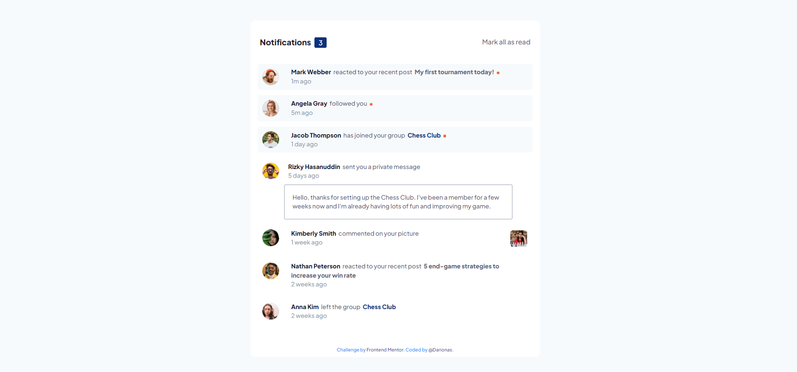

# Frontend Mentor - Notifications page solution

This is a solution to the [Notifications page challenge on Frontend Mentor](https://www.frontendmentor.io/challenges/notifications-page-DqK5QAmKbC).

## Table of contents

- [Overview](#overview)
  - [The challenge](#the-challenge)
  - [Screenshot](#screenshot)
  - [Links](#links)
- [My process](#my-process)
  - [Built with](#built-with)
  - [What I learned](#what-i-learned)
  - [Continued development](#continued-development)
  - [Useful resources](#useful-resources)
- [Author](#author)
- [Acknowledgments](#acknowledgments)

## Overview

### The challenge

Users should be able to:

- Distinguish between "unread" and "read" notifications
- Select "Mark all as read" to toggle the visual state of the unread notifications and set the number of unread messages to zero
- View the optimal layout for the interface depending on their device's screen size
- See hover and focus states for all interactive elements on the page

### Screenshot

### Links

- Solution URL: [Notifications page](https://github.com/Darionas/notifications_page)
- Live Site URL: [Notifications page](https://darionas.github.io/notifications_page/)

## My process

 * Create drawing from design (structure of design)
 * Create of repo
 * Create HTML layout
 * Create CSS layout according style guides
 * Create grid layout for mobile first
 * Craete grid layout for desktop
 * Implement JavaScript:
    * fetch data from data.json file

### Built with

- HTML
- CSS
- JavaCsript

But created with :heart:

### What I learned

- hide alt attribute value when src attribute value is not present
- get count of true values in object
- find if html element has certain class value

### Continued development

- Grid layout module.
- JavaScript (fetching data).
- Practise dealing with Git & GitHub.
- JavaScript modules
- Nodejs modules

### Useful resources

- [hide alt attribute value when src attribute value is not present](https://stackoverflow.com/questions/36305805/how-to-hide-alt-text-using-css-when-the-image-is-not-present#answer-49105591) - This helped me to hide alt attribute value when src attribute value is not present.
- [get count of true values](https://stackoverflow.com/questions/51915341/get-count-of-true-values-in-json-with-javascript#answer-51915372) - It lets get count of true values in object.
- [find out if html element has certain class value](https://stackoverflow.com/questions/9587070/if-statement-to-find-a-class-in-javascript#answer-9587185) - It lets find out if html element has certain class value.

## Author

- Frontend Mentor - [@Darionas](https://www.frontendmentor.io/profile/Darionas)

## Acknowledgments

- Thank you Frontend Mentor team for opportunity to try, practice, train yourself in different level challenges and gain invaluable experience.
- Thank you @Vikram from Frontend Mentor for guidance.
- Thank you @Grace from Frontend Mentor for guidance.
